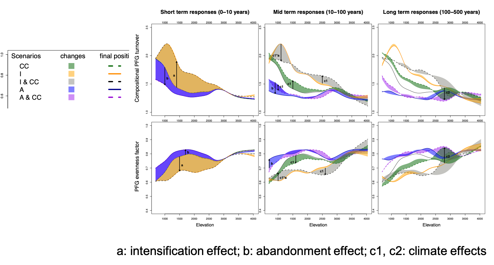

layout: true
.footer[
<!-- - @DrIsaBlg -->
- <i class="fab fa-github"></i>iboulangeat
<!-- - isabelle.boulangeat@irstea.fr -->
- 2019
<!-- -  -->
]
<!--  -->

---
class: title, smokescreen, no-footer
background-image: url(abandon.gif)
# FATE-HD, a landscape simulation model

---

class: compact, img-left
# FATE-HD, an hybrid model
FATE-HD among DVMs
  

.absolute.r-2.b-2[Boulangeat et al. 2014, GCB]

--

A landscape model dealing with **forest and non-forests**

- Response to climate (via Habitat model)
- Vegetation diversity (PFG)
- Simpified population dynamics (competition for light, dispersal, demography)
- Semi-quantitatif (easy to parameterize)
- Disturbances (fire, grazing, mowing)

---
class:
# FATE-HD model
.absolute.r-2.b-2[Boulangeat et al. 2014, GCB]

--

.absolute.r-4.t-3[Germination   Recruitment  Growth Survival Fecundity]

---
class:
# FATE-HD model
.absolute.r-2.b-2[Boulangeat et al. 2014, GCB]

.absolute.r-4.t-3[Germination   Recruitment  Growth Survival Fecundity]

--

--

---
class:
# FATE-HD model
.absolute.r-2.b-2[Boulangeat et al. 2014, GCB]

---
class: col-2
# Demography

- individuals grouped by cohorts
- maturity attribute
- longevity
  **seed production**
- = f(longevity, maturity) renewal hypothesis
- = f(habitat, stochasticity) yes/no
---
class: col-2
# Habitat filter

- habitat model (SDM)
- climate, soil, topography
- stochasticity and step response function for **seed production** and **establishment**
---
class: col-2
# Species interactions

- competition for light
- 3 light levels (low, medium, high)
- growth = age to change of strata

- response to light distinct from germinant, juveniles or matures
- maximum abundance in a pixel for each PFG
---
class: col-2
# Dispersal

- 50% of seed in a first circle having X pixels
- 49% in a second circle, by packages of two pixels for a total of X pixels
- 1% random in a larger buffer
  **parameters**
- dispersal distances for 50, 99% of seeds
- long distance
- can be based on traits including the most efficient dispersal mode (not the most prevalent)

---
class: col-2
# Disturbances

- pasture maps and intensity
- response of each PFG and stage (juvenile, mature, senescent)
- % of mortality and % of no seed production (rejuvenate)
---
class:
# Modular structure

---
class:
# Parameterization : data

---
class:
# Parameterization: from data to parameters

---
class: col-2
# Simulating current distribution of PFG

- seeding until large trees reach their final strata
- stabilization of the demography
- remove trees in managed areas (pastures)
- stabilization
- remove again trees in managed areas

---
class:
# Validation of the vegetation structure

---
class:
# FATE-HD vs SDM (at equilibrium)
Refine PFGs distribution inside their habitat limits

---
class:
# Simulate landscape dynamics under scenarios

.absolute.r-2.b-2[Boulangeat et al. 2014, Ecography]

---
class:
# Tree cover change over space and time

.absolute.l-4.t-30pct[Intensification]

<!-- .fixed.b-2.l-4[<video height="400" autoplay><source src="intens.mp4" type="video/mp4"></video>] -->
.absolute.r-5.t-30pct[Abandonment]

<!-- .fixed.b-2.r-4[<video height="400" autoplay><source src="abandon.mp4" type="video/mp4"></video>] -->
.absolute.r-2.b-2[Boulangeat et al. 2014, Ecography]

---
class:
# Changes in regional diversity

.absolute.r-2.b-2[Boulangeat et al. 2014, Ecography]

---
class:
# Changes in regional diversity
.absolute.r-2.b-2[Boulangeat et al. 2014, Ecography]

--

.absolute.l-3.t-5[additive effects]
--

.absolute.r-3.t-5[multiplicative effects]

---
class:
# Change in local diversity

.absolute.r-2.b-2[Boulangeat et al. 2014, Ecography]

---
class:
# Diversity decomposition
- change in **composition**
- change in **abundances**
.absolute.r-2.b-2[Boulangeat et al. 2014, Ecography]

--

\\[
^2D = ^0D \times EF
\\]

--
\\( ^0D = \\) richness -> beta = compositional turnover

\\( EF =\\) evenness factor -> beta = abundances re-arrangement

---
class: fit-h1, no-footer
# Changes over time, elevation and diversity dimensions

.absolute.r-2.b-2[Boulangeat et al. 2014, Ecography]

---
class: fit-h1
# Main highlights about the changes in functional diversity

.absolute.r-2.b-2[Boulangeat et al. 2014, Ecography]
--
 
**Effet of human land-use:**
Heterogeneity (beta) in average decreases in case of tree colonization but increases in case of habitat loss

**Effect of different PFG assemblages:**
The diversity response depends on elevation

**Interaction between drivers:**
Multiplicative effects are found when land abandonment is combined with climate change

<!-- ========================================================================== -->

---

class: no-footer
background-image: url(marais_acide_lautaret.JPG)
# Thanks
Damien, Pauline, Maya, Wilfried
  Richard, Cédric, Sylvain, Jérémie, Pascal, Rolland
